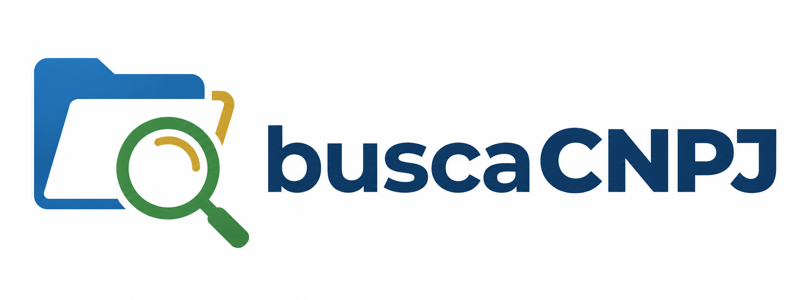

# 🔍 BuscaCNPJ


<!-- Troque pelo caminho de um print real do projeto -->


> O **BuscaCNPJ** é uma aplicação web que consulta dados cadastrais de empresas brasileiras a partir do CNPJ, usando a API pública [MinhaReceita](https://minhareceita.org/). Digite um CNPJ válido e veja na hora informações como razão social, endereço, telefone, capital social e natureza jurídica.

### 🛠️ Tecnologias utilizadas

- HTML5
- CSS3 (fonte Montserrat via Google Fonts)
- JavaScript (Vanilla, sem frameworks ou dependências)

### ✨ Funcionalidades

- Busca de empresa por CNPJ, com validação do número digitado (precisa ter 14 dígitos; caso contrário, um aviso é disparado para informar o problema).
- Exibição dos principais dados da empresa: razão social, nome fantasia, CNAE fiscal, data de início de atividade, país, UF, CEP, município, bairro, logradouro, número, complemento, capital social (formatado em R$), telefones (formatados) e natureza jurídica.

### Ajustes e melhorias

O projeto ainda está em desenvolvimento. As próximas atualizações serão voltadas para as seguintes tarefas:

- [ ] A lógica das abas "QSA" e "CNAEs Secundários" ainda não está implementada nos arquivos JS do projeto
- [ ] Tratamento de erro da requisição — hoje o `fetch` não trata falhas de rede/API (sem CNPJ encontrado, API fora do ar, etc.)
- [ ] Loading/feedback visual durante a busca
- [ ] Layout e Exportação de resultados

## 💻 Pré-requisitos

Antes de começar, verifique se você atendeu aos seguintes requisitos:

- Navegador web atualizado (Chrome, Firefox, Edge, etc) .
- Boa conexão com a internet, já que o projeto consome a API pública [MinhaReceita](https://minhareceita.org/) em tempo real.
- Não há dependências de instalação (Node, frameworks, servidor local, etc.) — o projeto é 100% front-end estático e roda direto abrindo o `index.html`.

>[!IMPORTANT]
>Verifique  se seu navegador está atualizado, isso garante uma melhor comunicação com a API

## 🚀 Instalando o BuscaCNPJ

Para instalar o BuscaCNPJ, siga estas etapas:

```bash
git clone https://github.com/Joao-Pedro-Monteiro/buscaCNPJ.git
cd buscaCNPJ
```

Esse comando funciona da mesma forma em Linux, macOS e Windows.

## ☕ Usando o BuscaCNPJ

Basta abrir o arquivo `index.html` diretamente no navegador (duplo clique, ou botão direito → Abrir com). A API MinhaReceita aceita requisições vindas de `file://`, então não é necessário nenhum servidor local para rodar o projeto.

1. Digite um CNPJ válido (14 dígitos, com ou sem pontuação) no campo de busca.
2. Clique em **Buscar**.
3. Os dados da empresa aparecem no painel à esquerda. As abas "QSA" / "CNAEs Secundários" e outras, ficaram disponíveis no painel à direita na próxima atualização.

>[!CAUTION]
>Se em algum momento a busca parar de funcionar com o arquivo aberto direto, é sinal de que a API mudou sua política de CORS — nesse caso, sirva os arquivos com um servidor local (ex: extensão Live Server do VS Code, ou `npx serve .`) para contornar o problema.
>Caso o uso do servidor local não resolva, abra uma ISSUE e reporte o problema.


## 📁 Estrutura do projeto

```
buscaCNPJ/
├── images/
│   ├── logo.png
│   └── icons/
│       ├── githubLight.svg
│       └── search.svg
├── script/
│   ├── home.js     # navegação do header (logo e botão do GitHub)
│   └── query.js     # validação de CNPJ, chamada à API e exibição dos dados
├── style/
│   └── home.css
└── index.html
```

## 📫 Contribuindo para o BuscaCNPJ

Para contribuir com o BuscaCNPJ, siga estas etapas:

1. Bifurque este repositório. (`fork`)
2. Crie um branch: `git checkout -b minha-feature`.
3. Faça suas alterações e confirme-as: `git commit -m 'feat: minha nova feature'`
4. Envie para o branch original: `git push origin buscaCNPJ / minha-feature`
5. Crie a solicitação de pull.

Consulte a documentação do GitHub em [como criar uma solicitação pull](https://help.github.com/en/github/collaborating-with-issues-and-pull-requests/creating-a-pull-request).

## 📝 Licença

Este projeto ainda não possui uma licença definida. Caso deseje reutilizá-lo, entre em contato com o autor.
